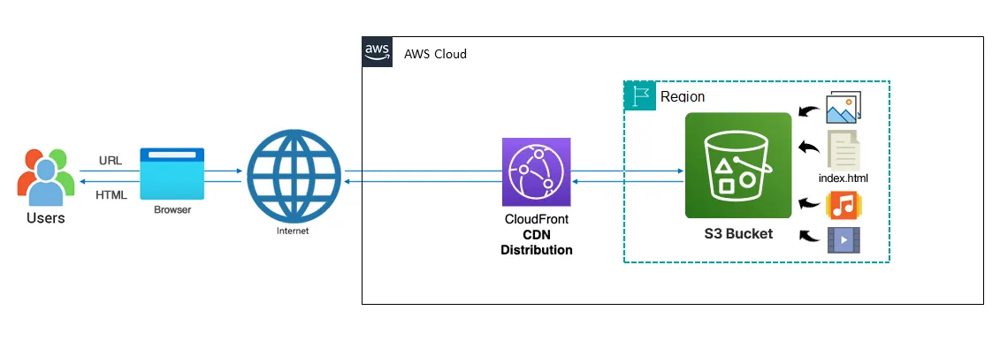
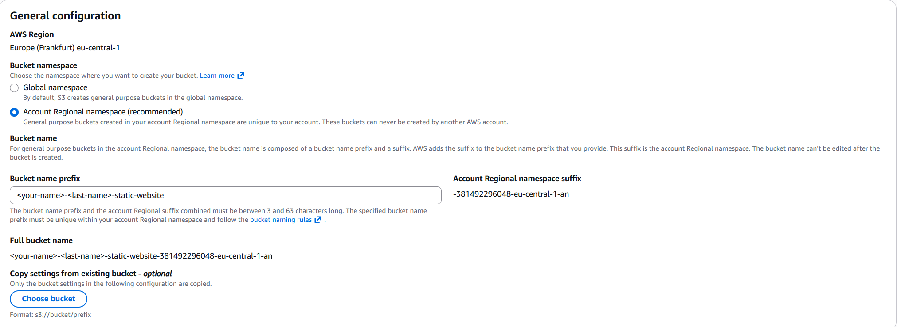
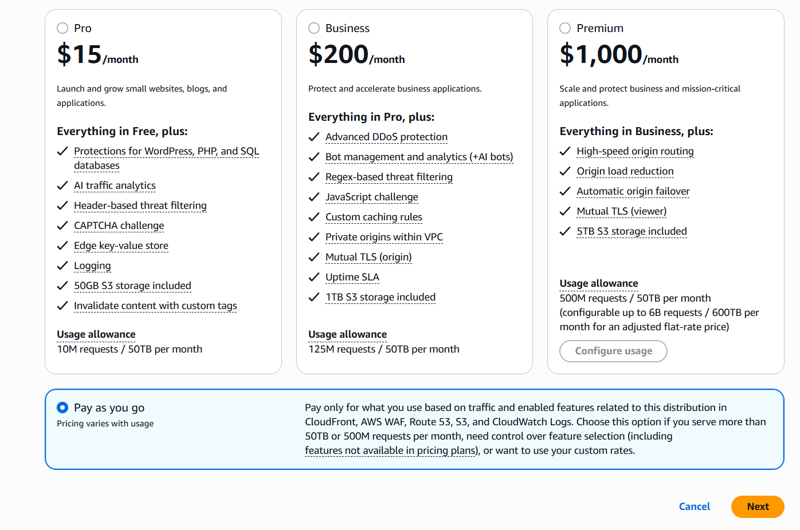
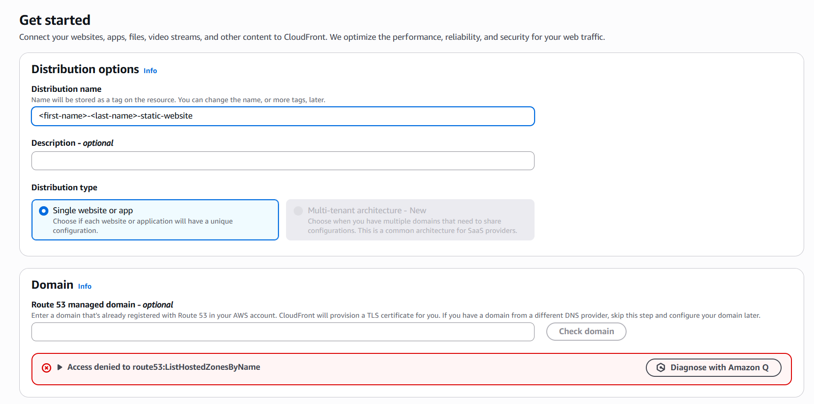
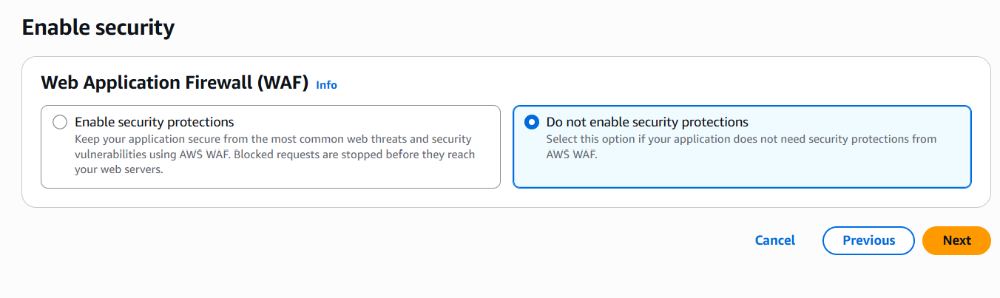
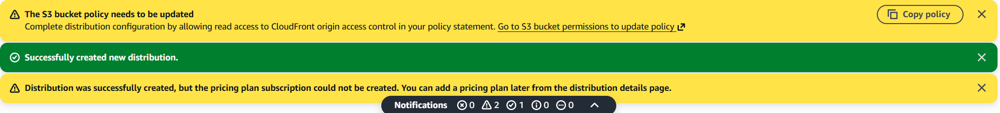
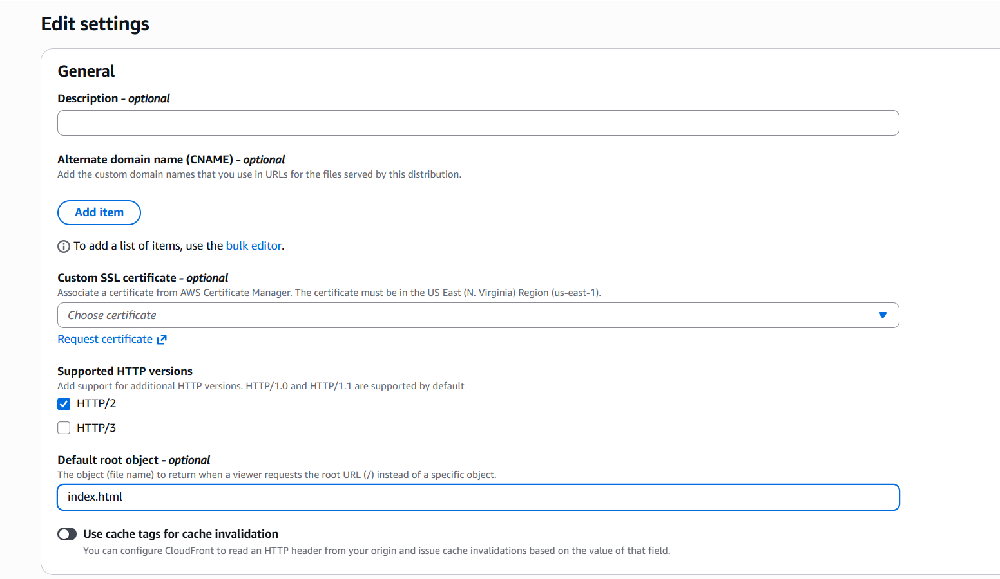
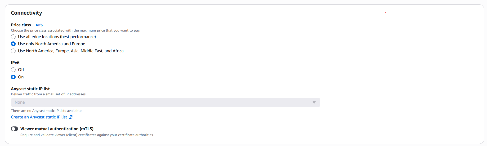

# Lab 01 — Static Website Hosting & Global Distribution

**Services:** Amazon S3 · Amazon CloudFront | **Region:** eu-central-1 | **Time:** 40 min

## Goal

Host a static HTML website on Amazon S3 and distribute it globally using Amazon CloudFront with Origin Access Control (OAC). By the end, your website will be reachable via a CloudFront URL while the S3 bucket remains completely private — a pattern used by every production static site on AWS.

## Architecture



## Prerequisites

- Logged into the AWS Console as your student IAM user
- Region set to **EU (Frankfurt) eu-central-1**
- An `index.html` file ready to upload — see below if you don't have one yet

> **Don't have an `index.html` yet? Generate one with AI:**
> 1. Open your AI tool of choice (ChatGPT, Claude, Gemini, etc.)
> 2. Paste this prompt, picking any product you like:
>    ```
>    You are a professional frontend developer. Create a website for me to sell [pick anything — shoes, cars, planes, watches, etc.]. Global users should be able to browse and purchase the item, with a variety of listings showing different images, descriptions, and prices. Use only HTML — no frameworks, no backend, no JavaScript required.
>    ```
> 3. Copy the generated code into VS Code (or your preferred IDE), and save the file as `index.html`
>
> This is the file you'll upload to S3 in Part A, Step 5 below.

---

## Steps

### Part A — Create an S3 Bucket

**1.** Open the **S3** console and click **Create bucket**.

**2.** Under **Bucket namespace**, select **Account Regional namespace (recommended)**.  
In the **Bucket name prefix** field enter: `<your-name>-<last-name>-static-website`  
Use your real first and last name in **lowercase** — e.g. `jane-doe-static-website`.  
AWS automatically appends `-123456789012-eu-central-1-an` to form the full bucket name.



**3.** Under **Object Ownership**, leave **ACLs disabled** (default).

**4.** Under **Block Public Access settings** — leave all boxes **checked** (default). The bucket stays private; CloudFront will access it using OAC.

> **Expected — Default Encryption notice:** You may see a banner saying *"Insufficient permissions to apply Default Encryption"*. This is expected — S3 already encrypts all objects by default (SSE-S3). Skip this section and continue.

**5.** Leave all other settings as default and click **Create bucket**. Then open your bucket → **Upload** → **Add files**, upload an `index.html` file, and click **Upload**.

---

### Part B — Create a CloudFront Distribution

**6.** Open the **CloudFront** console → click **Create distribution**.  
A plan selection page appears. Scroll to the bottom, select **Pay as you go**, and click **Next**.



**7.** On the **"Get started"** page:
- **Distribution name**: same prefix as your S3 bucket (e.g. `jane-doe-static-website`)
- **Distribution type**: **Single website or app**
- **Domain section**: you'll see *"Access denied to route53:ListHostedZonesByName"* — expected, leave it blank



Click **Next**.

**8.** On the **Origin** page:
- **Origin type**: **S3**
- Click **Browse S3** and select your recently created bucket
- Under **Origin access**: select **Origin access control settings (recommended)** → **Create new OAC** → accept defaults → **Create**
- Leave all other settings as default

Click **Next**.

**9.** On the **"Enable security"** page, select **Do not enable security protections** and click **Next**.



**10.** Review the summary and click **Create distribution**.



**If the banners appear:**
- **Yellow** — *"The S3 bucket policy needs to be updated"*: click **Copy policy**, then click **"Go to S3 bucket permissions to update policy"** and proceed to step 11
- **Green** — *"Successfully created new distribution."* ✓
- **Yellow** — *"pricing plan subscription could not be created"* — expected, ignore it

**If the banners do not appear:**
1. From your distribution page, click the **Origins** tab
2. Select your existing origin and click **Edit**
3. Under **Origin access**, click **Copy policy**
4. Go to **S3** → your bucket → **Permissions** → **Bucket policy** → **Edit**, paste the policy, and click **Save changes**

---

### Part C — Update the S3 Bucket Policy

**11.** In your bucket's **Permissions** tab, scroll to **Bucket policy** and click **Edit**. Paste the copied OAC policy and click **Save changes**.

---

### Part D — Configure the Distribution

**12.** Go to **CloudFront → Distributions**. Find your distribution (by your bucket name in the Origin column) and click on it. Wait until **Status** shows **Enabled** (2–5 minutes).

**13.** Go to the **General** tab → click **Edit**:
- Scroll to **Default root object** and type `index.html`



- Scroll to **Connectivity → Price class** and select **Use only North America and Europe**



Click **Save changes**.

---

### Part E — Test

**14.** Copy the **Distribution domain name** (e.g. `d1abc.cloudfront.net`). Open a new browser tab, paste it, and press Enter — your HTML page should appear over HTTPS.

---

## Verification

- `https://<your-domain>.cloudfront.net` shows your HTML page over HTTPS ✅
- `https://<your-bucket-full-name>.s3.eu-central-1.amazonaws.com/index.html` returns **AccessDenied** — the bucket is private ✅

---

## Key Exam Concepts

| Concept | What to Know |
|---------|-------------|
| **OAC vs OAI** | Origin Access Control is the modern replacement for Origin Access Identity — expect exam questions on the difference |
| **S3 Block Public Access** | Blocks public ACLs and policies; required alongside OAC for a fully private origin |
| **CloudFront edge caching** | Reduces latency by serving cached content from 400+ edge locations globally |
| **HTTPS enforcement** | "Redirect HTTP to HTTPS" is the recommended viewer protocol policy |
| **Default root object** | Without this, a request to `/` returns 403; setting it to `index.html` maps the root correctly |
