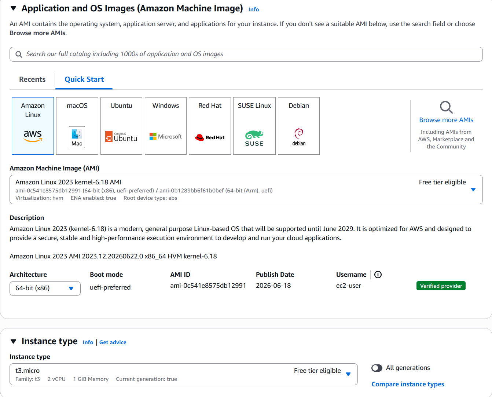
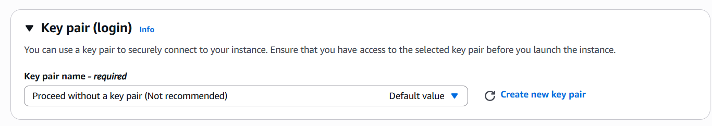
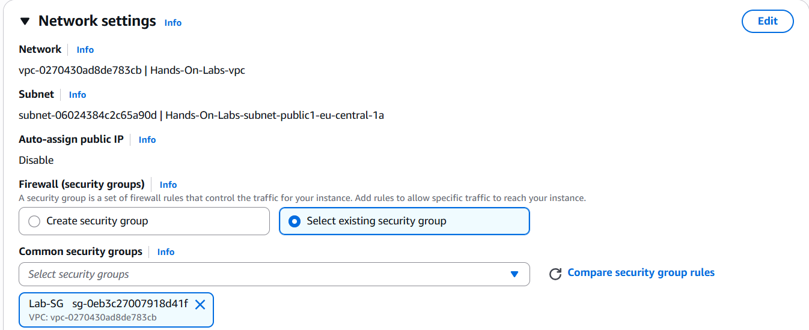
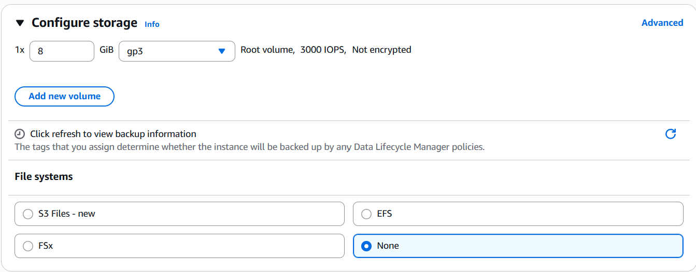
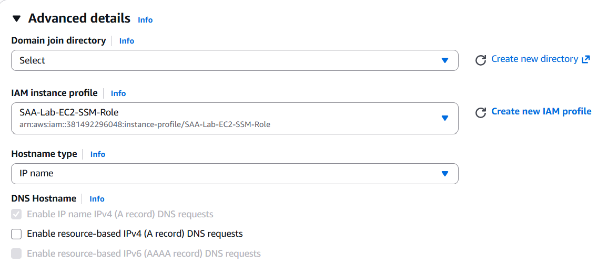
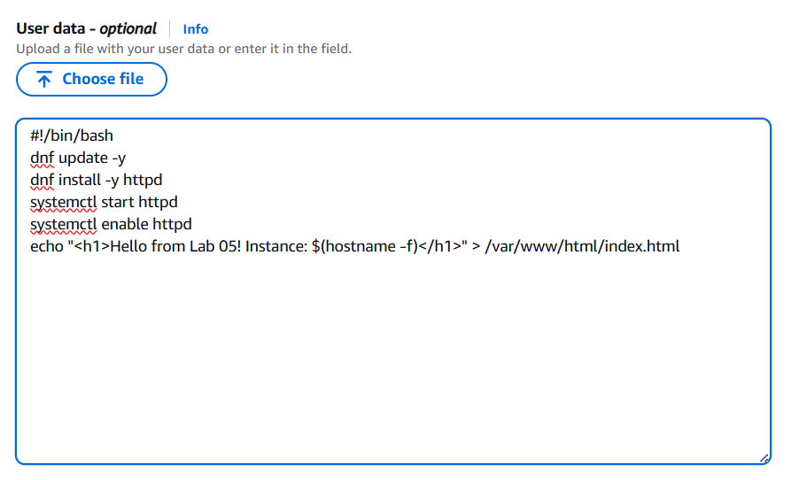

# Lab 05 — Secure Compute Infrastructure

**Services:** Amazon EC2 · AWS Systems Manager (Session Manager) · IAM Instance Profile | **Region:** eu-central-1 | **Time:** 45 min

## Goal

Launch a secure EC2 instance with **no SSH access** — no key pair, no port 22 open. You will access the instance through AWS Systems Manager Session Manager, which routes traffic through AWS's secure control plane. Apache is installed automatically via User Data.

> **Security highlight:** No key pair is created or attached. Access is granted exclusively through IAM — if your IAM user loses session access, so does the instance.

## Architecture

```
You (Browser) → SSM Session Manager → EC2 t3.micro (Amazon Linux 2023, Apache running)
                                              ↕
                                    IAM Instance Profile: SAA-Lab-EC2-SSM-Role
                                    Security Group: Lab-SG (TCP 443 inbound, all outbound)
```

## Prerequisites

- AWS Console open, region set to **EU (Frankfurt) eu-central-1**
- Instructor pre-created `SAA-Lab-EC2-SSM-Role` with `AmazonSSMManagedInstanceCore` attached
- Instructor pre-created `Lab-SG` security group (TCP 443 inbound from `0.0.0.0/0`, all outbound)
- **No key pair needed** — this is the point of the lab

---

## Steps

### Part A — Launch the EC2 Instance

**1.** Open **EC2** → **Instances** → **Launch instances**.

**2.** Name your instance using the format: `<firstname>-<lastname>-lab`
(Example: `john-doe-lab`). AMI: leave as **Amazon Linux 2023 AMI** (the default). Instance type: confirm **t3.micro**.



**3.** Key pair: open the dropdown and select **Proceed without a key pair (Not recommended)**. Do not create a new key pair.



**4.** Under **Network settings** → click **Edit**. In the **Firewall (security groups)** section, choose **Select existing security group**, then select **Lab-SG** from the dropdown. Leave all other network settings as default.



**5.** Under **Configure storage**: leave the default **(1x 8 GiB gp3)**. Do not change the volume type or size.



**6.** Scroll down and expand **Advanced details**.

- **IAM instance profile**: select `SAA-Lab-EC2-SSM-Role`
- Leave **Purchasing option**, **Placement group**, and all other fields as default



**7.** Scroll to the very bottom of Advanced details to the **User data** field. Paste the script below, then click **Launch instance**. When the key pair confirmation dialog appears, select **Proceed without key pair** and confirm.

```bash
#!/bin/bash
dnf update -y
dnf install -y httpd
systemctl start httpd
systemctl enable httpd
echo "<h1>Hello from Lab 05! Ben is the best instructor 😊 Instance: $(hostname -f)</h1>" > /var/www/html/index.html
```



---

### Part B — Connect via Session Manager

**8.** Wait ~2 minutes. In **EC2 → Instances**, confirm your instance shows **Running** and **2/2 checks passed**.

**9.** Select your instance → click **Connect** → choose the **Session Manager** tab → click **Connect**.

**10.** A browser-based terminal opens. Run:

```bash
curl http://localhost
```

Expected output: `<h1>Hello from Lab 05! Instance: ip-x-x-x-x.eu-central-1.compute.internal</h1>`

**11.** Verify Apache is running:

```bash
systemctl status httpd
```

**12.** Go back to your instance summary and copy the **Public IPv4 address**. Open a new browser tab and navigate to:

```
http://<your-public-ip>
```

You should see the Apache page served publicly — over HTTP, with no SSH or interactive access exposed.

---

## Verification

- Session Manager tab shows a live terminal — without any key pair or SSH port ✅
- `curl http://localhost` returns the Apache HTML page ✅
- EC2 → your instance → **Security** tab → **Security groups** shows `Lab-SG` ✅
- EC2 → your instance → **Security** tab → **IAM Role** shows `SAA-Lab-EC2-SSM-Role` ✅

---

## Key Exam Concepts

| Concept | What to Know |
|---------|-------------|
| **IAM Instance Profile** | A container that attaches an IAM Role to an EC2 instance — the instance receives temporary credentials via IMDS |
| **AmazonSSMManagedInstanceCore** | The AWS managed policy that grants SSM Agent on the instance permission to communicate with the SSM service |
| **Session Manager vs SSH** | Session Manager requires no open port, no key pair, is fully audited via CloudTrail, and can be restricted per user via IAM |
| **User Data** | A bootstrap script that runs once at instance launch as root — used for software installation and service startup |
| **Security Group — stateful** | Outbound HTTPS (443) is allowed, so SSM response traffic is automatically permitted back — this is why SSM works with no inbound SSH rule |
| **NACL — stateless** | Unlike Security Groups, NACLs must explicitly allow both directions. For SSM: outbound TCP 443 (agent → AWS endpoints) AND inbound TCP 1024–65535 (ephemeral return ports from AWS back to the instance) |
